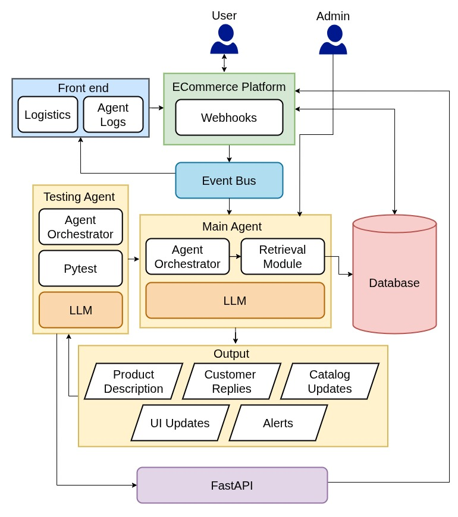
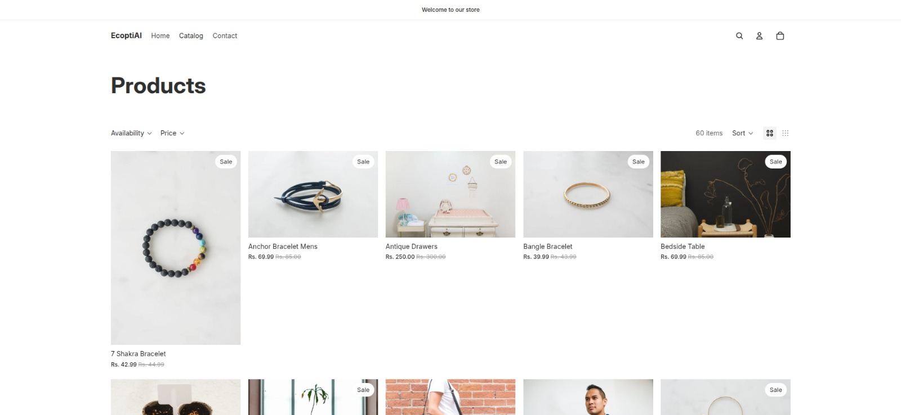
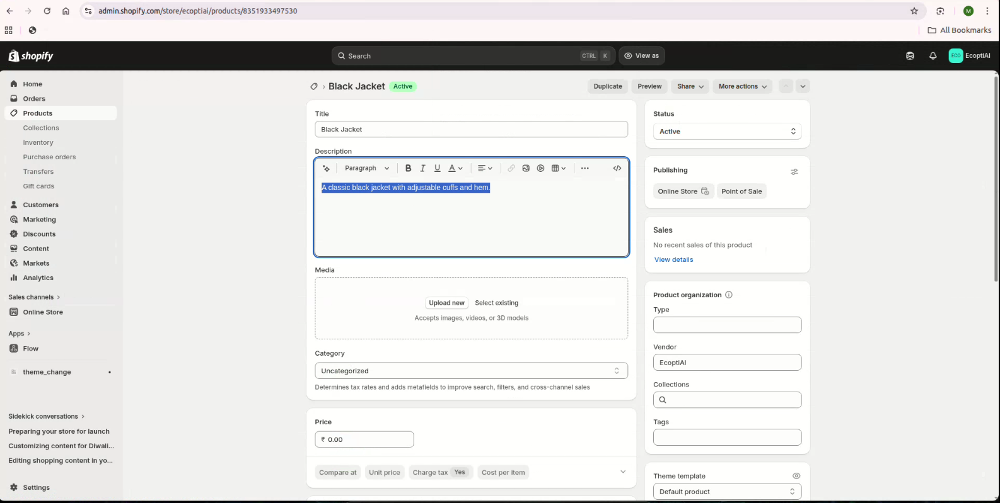
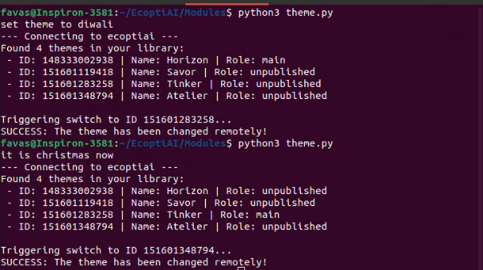
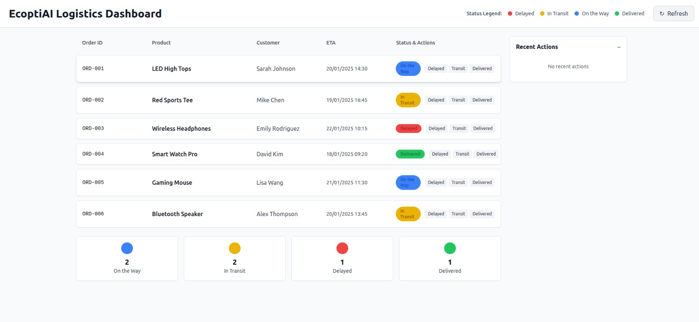
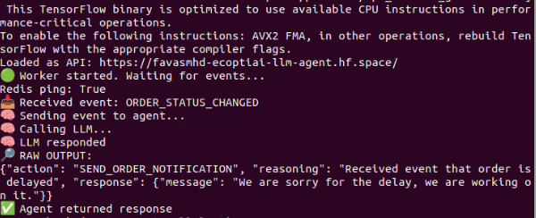
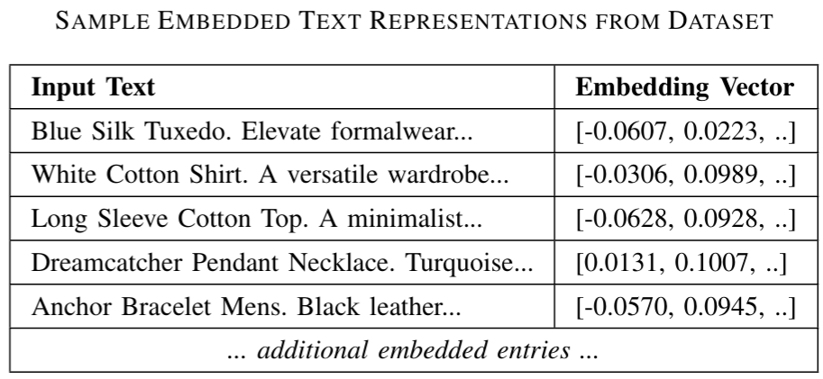
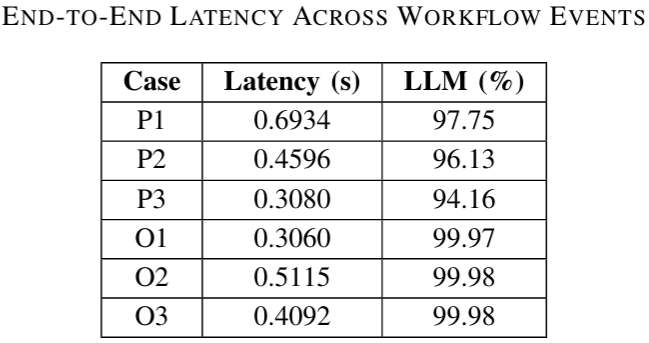
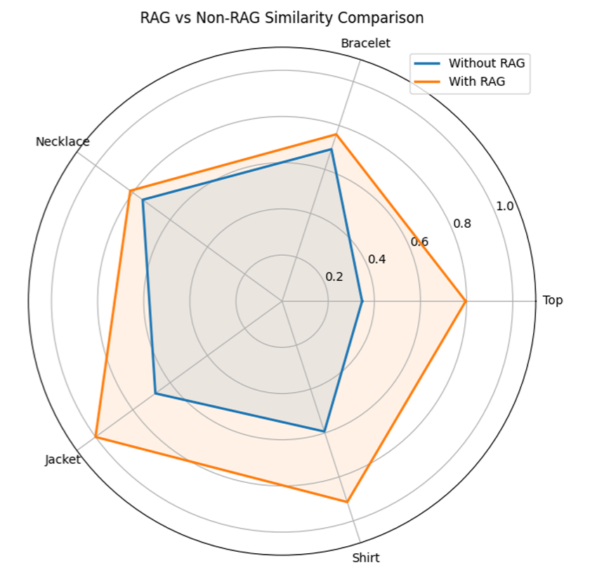

# An Agentic AI Framework for E-Commerce Automation

> An event-driven AI-powered e-commerce automation framework that leverages Large Language Models (LLMs), Retrieval-Augmented Generation (RAG), and intelligent workflows to streamline store operations and enhance customer experience.

---

## Overview

Managing modern e-commerce platforms involves repetitive tasks such as generating product descriptions, notifying customers about deliveries, and running promotional campaigns. This project demonstrates how agentic AI can automate these workflows by integrating LLMs with an event-driven architecture.

By combining Retrieval-Augmented Generation (RAG) with modern language models, the system produces context-aware content and enables intelligent automation for common e-commerce operations.

---

## Features

* AI-powered product description generation
* Retrieval-Augmented Generation (RAG) using SentenceTransformers
* Shopify development store integration
* Webhook-driven event processing
* Redis-based event bus for asynchronous communication
* Logistics simulation for delivery status management
* AI-generated empathetic delivery delay notifications
* Prompt-driven campaign automation

---

## System Architecture



---

## Technology Stack

* Python
* FastAPI
* LangChain
* LLaMA 3
* Groq API
* SentenceTransformers
* Redis
* Shopify Development Store
* Twilio

---

## Getting Started

### Clone the Repository

```bash
git clone https://github.com/<username>/<repository-name>.git
cd <repository-name>
```

### Create a Virtual Environment

**Linux/macOS**

```bash
python3 -m venv venv
source venv/bin/activate
```

**Windows**

```bash
python -m venv venv
venv\Scripts\activate
```

### Install Dependencies

```bash
pip install -r requirements.txt
```

### Configure Environment Variables

Copy the example environment file and update it with your own credentials.

```bash
cp .env.example .env
```

The `.env.example` file contains all required configuration variables for services such as Groq, Shopify, Redis, and Twilio.

### Run the Application

```bash
uvicorn main:app --reload
```

The backend will start on the default FastAPI development server.

---

## Workflow

### Product Description Generation

1. Product information is received.
2. Relevant contextual information is retrieved through the RAG pipeline.
3. The retrieved context is supplied to the language model.
4. A context-aware product description is generated.

### Delivery Delay Automation

1. A delivery status update triggers a webhook event.
2. The event is propagated through Redis.
3. The language model generates an empathetic customer notification.
4. The notification is delivered automatically.

### Campaign Automation

1. An administrator issues a campaign instruction.
2. The system processes the request through the event-driven workflow.
3. Campaign messages or storefront behavior are updated accordingly.

---

## Demo Screenshots

### Shopify Development Store



### AI Product Description Generation

Automatically generates context-aware product descriptions using Retrieval-Augmented Generation.



### Dynamic Theme Change

Example of AI-assisted seasonal storefront customization.



### Logistics Simulation Dashboard

Interface used to simulate logistics events and delivery updates.



### Empathetic Delivery Delay Notification

Automatically generated customer notification following a simulated delivery delay.



### RAG Vector Embeddings Visualization

Visualization of semantic embeddings used within the retrieval pipeline.



---

## Performance Analysis

### End-to-End Latency Analysis

The chart below illustrates the total processing latency and the proportion attributable to language model inference.



### RAG vs. Non-RAG Comparison

Comparison of semantic similarity scores between responses generated with Retrieval-Augmented Generation and direct prompting.



### Key Observations

* Retrieval augmentation improves contextual relevance.
* Event-driven processing enables modular workflow orchestration.
* AI-generated customer communication produces more natural responses.
* LLM inference contributes significantly to overall response latency.

---

## Future Enhancements

* Customer-facing conversational shopping assistant
* Advanced analytics and monitoring dashboard
* AI-driven personalized recommendation engine
* Multilingual support
* Scalable cloud and edge deployment

---

## Applications

* Intelligent e-commerce assistants
* Automated catalog management
* Customer communication automation
* AI-assisted marketing campaigns
* Event-driven workflow orchestration
* Context-aware content generation

---

## Disclaimer

This project was developed as part of a final-year B.Tech academic initiative to explore the integration of Large Language Models, Retrieval-Augmented Generation, and event-driven architectures in e-commerce automation. It is intended as a research prototype and proof of concept.

---

## Authors

Developed by
- [Mohammed Favas](https://github.com/favasmhd)
- [Malavika Sreekumar](https://github.com/)
- [Achu Rachel Babu](https://github.com/)

